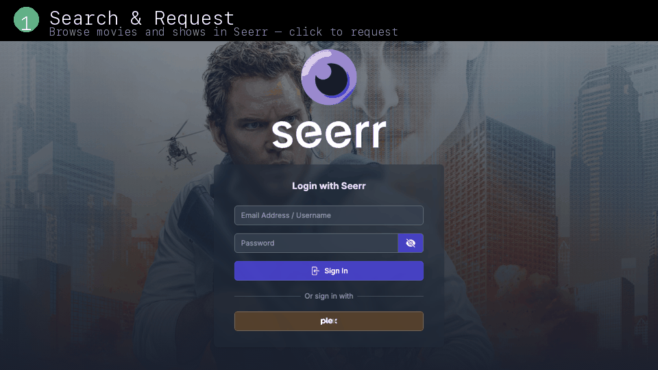

<div align="center">
  <br>
  <a href="#one-command-install">
    
  </a>
  <br>
  
  <br><br>
  <strong>Fully automated, self-healing media server for macOS</strong>
  <br>
  <sub>Everything from the <a href="https://github.com/liamvibecodes/mac-media-stack">basic stack</a>, plus transcoding, quality profiles, metadata automation, download watchdog, VPN failover, and automated backups.</sub>
  <br><br>
  
  
  
  
  
  
  
  
  
  
  
  <br><br>
  
  
  <br><br>
</div>

## Why This One?

There are dozens of *arr stack Docker Compose repos on GitHub. Almost all of them dump a compose file and leave you to figure out the rest. This one is different:

- **One command to install.** Clone, configure, and start everything with a single `curl | bash`. No 45-minute manual setup.
- **Auto-configures itself.** The configure script wires up all 13 services via their APIs. No clicking through web UIs.
- **Built for macOS.** Native paths, launchd instead of systemd, OrbStack or Docker Desktop instead of bare Docker. Not a Linux guide with "should work on Mac" in the footnotes.
- **Self-healing.** Hourly health checks, download watchdog, VPN failover between providers. Runs unattended.
- **Quality automation.** TRaSH Guides profiles filter out bad releases. Kometa keeps Plex metadata clean. Tdarr saves disk space with automatic transcoding.

New to self-hosted media? Start with the [basic version](https://github.com/liamvibecodes/mac-media-stack) first.

---

## What's Added Over Basic

| Service | What It Does |
|---------|-------------|
| **Tdarr** | Automatic transcoding (convert codecs, save disk space) |
| **Recyclarr** | TRaSH Guides quality profiles (penalizes bad release groups, scene releases) |
| **Kometa** | Plex metadata automation (franchise collections, resolution overlays, RT ratings) |
| **Unpackerr** | Auto-extracts RAR'd downloads for Radarr/Sonarr |

## Optional: Music (Lidarr + Tidarr)

| Service | What It Does |
|---------|-------------|
| **Lidarr** | Automatic music management (like Sonarr/Radarr but for music albums) |
| **Tidarr** | Downloads FLAC from Tidal (up to 24-bit/192kHz). Web UI + Lidarr integration |

Music services use Docker Compose profiles and are not started by default. To enable:

```bash
bash scripts/setup-music.sh
docker compose --profile music up -d
```

Then open Tidarr at `http://localhost:8484` to authenticate with your Tidal account, and Lidarr at `http://localhost:8686` to configure your music library. See the [Music Setup](#music-setup) section below for details.

## Automation

| Script | Schedule | What It Does |
|--------|----------|-------------|
| Auto-healer | Hourly | Restarts VPN/containers if they go down |
| Nightly backup | Daily | Backs up all configs and databases (14-day retention) |
| Download watchdog | Every 15 min | Detects stalled/slow torrents, auto-fixes or swaps them |
| Kometa | Every 4 hours | Updates Plex collections and metadata overlays |
| VPN failover | Every 2 min (optional) | Auto-switches between ProtonVPN and NordVPN on sustained failure |

## One-Command Install

Requires OrbStack (or Docker Desktop) and Plex already installed. Handles everything else.

```bash
curl -fsSL https://raw.githubusercontent.com/liamvibecodes/mac-media-stack-advanced/main/bootstrap.sh | bash
```

<details>
<summary>See it in action</summary>
<br>

</details>

## Manual Quick Start

If you prefer to run each step yourself:

```bash
git clone https://github.com/liamvibecodes/mac-media-stack-advanced.git
cd mac-media-stack-advanced
bash scripts/setup.sh
# edit .env with VPN keys
docker compose up -d
docker compose --profile autoupdate up -d watchtower  # optional auto-updates
bash scripts/configure.sh
bash scripts/install-launchd-jobs.sh
```

## Full Setup Guide

See [SETUP.md](SETUP.md) for the complete walkthrough.
Pinned digest matrix: [IMAGE_LOCK.md](IMAGE_LOCK.md)

By default, Seerr is bound to `127.0.0.1` for safer local-only access. Set `SEERR_BIND_IP=0.0.0.0` in `.env` only if you intentionally want LAN exposure.

## What It Looks Like



## How It Works


```
Seerr (request) -> Radarr/Sonarr -> Prowlarr (search) -> qBittorrent (via VPN) -> Plex (watch)
                                                           |
                                     Unpackerr (extract) --+
                                     Bazarr (subtitles) ----+
                                     Tdarr (transcode) -----+
                                     Kometa (metadata) ------> Plex
                                     Recyclarr (quality) ----> Radarr/Sonarr

Optional music:
                   Lidarr (music management) -> Prowlarr / Tidarr -> Plex (listen)
                   Tidarr (Tidal FLAC downloads) ----^
```

All download traffic routes through ProtonVPN (with optional NordVPN failover). Everything else uses your normal connection. All services auto-start on boot and self-heal if they go down.

## Scripts

| Script | Purpose |
|--------|---------|
| `scripts/setup.sh` | Creates folders, generates .env, copies config templates |
| `scripts/configure.sh` | Auto-configures all service connections via API |
| `scripts/health-check.sh` | Full stack health diagnostic |
| `scripts/install-launchd-jobs.sh` | Installs all automation as background jobs |
| `scripts/install-vpn-failover.sh` | Installs VPN failover (requires NordVPN backup) |
| `scripts/auto-heal.sh` | Hourly self-healer |
| `scripts/backup.sh` | Config and database backup |
| `scripts/download-watchdog.py` | Stalled torrent detection and auto-fix |
| `scripts/vpn-mode.sh` | Manual VPN provider switcher |
| `scripts/vpn-failover-watch.sh` | Automatic VPN failover daemon |
| `scripts/run-kometa.sh` | Trigger Kometa metadata run |
| `scripts/setup-music.sh` | Creates music directories and Tidarr config (optional) |
| `scripts/refresh-image-lock.sh` | Refreshes pinned image digests and regenerates IMAGE_LOCK.md |

## Config Templates

Pre-configured templates in `configs/` (copy to your Media folder after first boot):

- **recyclarr.yml** - TRaSH Guides quality profiles for Radarr and Sonarr
- **kometa.yml** - Plex metadata automation (franchise collections, resolution overlays)

Both require API keys that are generated on first boot. The configure script will print them for you.

## Music Setup

Music is optional and uses Docker Compose [profiles](https://docs.docker.com/compose/profiles/). The core stack works without it.

### What You Get

- **Lidarr** manages your music library the same way Radarr handles movies. It monitors artists, searches for albums via Prowlarr, and imports downloads into your Plex music folder.
- **Tidarr** downloads FLAC directly from Tidal (up to 24-bit/192kHz Hi-Res). It has a web UI for manual downloads and also acts as an indexer + download client for Lidarr, so Lidarr can search and download from Tidal automatically.

### Quick Start

```bash
# 1. Create music directories and config
bash scripts/setup-music.sh

# 2. Start the music services
docker compose --profile music up -d

# 3. Authenticate with Tidal
#    Open http://localhost:8484 and follow the OAuth device flow

# 4. Configure Lidarr
#    Open http://localhost:8686
#    - Settings > Media Management > Add root folder: /music
#    - Settings > Download Clients > Add SABnzbd:
#        Host: tidarr, Port: 8484, URL Base: /api/sabnzbd
#    - Settings > Indexers > Add Newznab:
#        URL: http://tidarr:8484, API Path: /api/lidarr
#        Categories: 3000, 3010, 3040
#    - Settings > Download Clients > Add qBittorrent (for torrent fallback):
#        Host: gluetun, Port: 8080
```

### Tidarr Download Config

The setup script creates a default `tiddl` config at `~/Media/config/tidarr/.tiddl/config.toml`. Key settings:

- **Quality:** `max` (24-bit Hi-Res FLAC when available, falls back to 16-bit/44.1kHz)
- **Download path:** Your Plex music folder (files go directly to the library)
- **Skip existing:** Won't re-download albums you already have
- **File template:** `Artist/Album/01 Track Title.flac` (Plex-compatible naming)

### Day-to-Day

| What | Where |
|------|-------|
| Search and download from Tidal manually | http://localhost:8484 |
| Manage music library (add artists, monitor) | http://localhost:8686 |
| Listen via Plex/Plexamp | http://localhost:32400/web |

### Starting/Stopping Music Services

```bash
# Start music services
docker compose --profile music up -d

# Stop only music services (keeps everything else running)
docker compose --profile music stop lidarr tidarr

# Include music in all future docker compose commands
# Add to your shell profile:
export COMPOSE_PROFILES=music
```

## Author

Built by [@liamvibecodes](https://github.com/liamvibecodes)

## License

[MIT](LICENSE)
